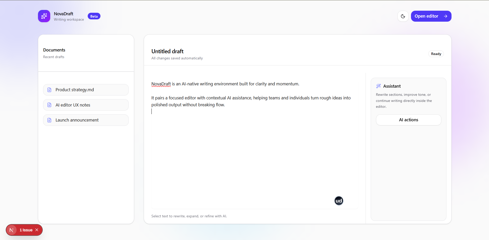
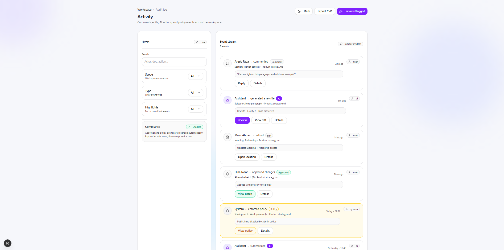
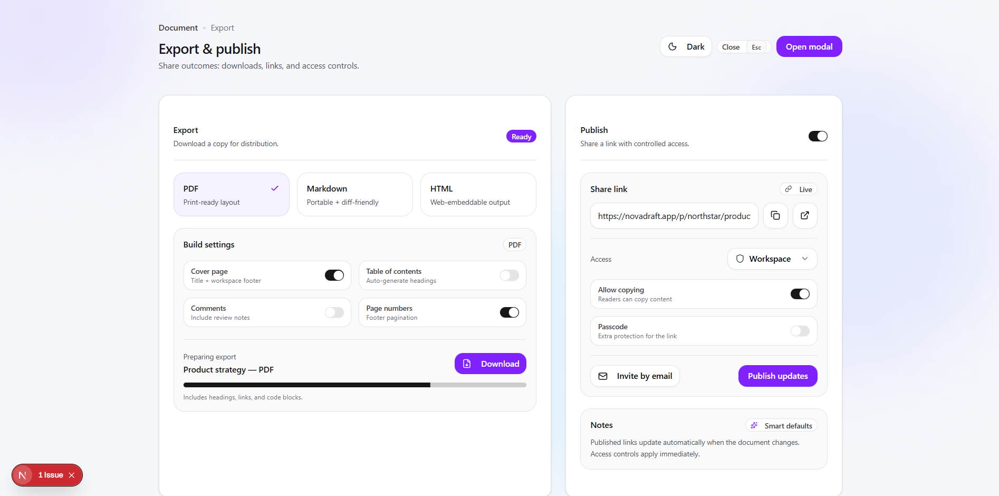
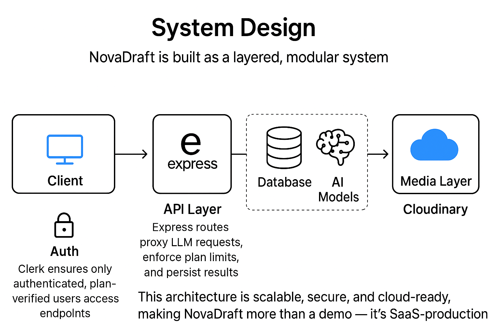

# NovaDraft — AI-Powered Writing & Image Suite

> **A full-stack AI SaaS platform for intelligent writing, image generation, resume analysis, and publishing workflows.**

**Author:** Maaz Ansari
**Email:** [maazansari25667@gmail.com](mailto:maazansari25667@gmail.com)
**GitHub:** [https://github.com/AnsariTech-25667](https://github.com/AnsariTech-25667)

NovaDraft is a production-grade AI productivity platform engineered to streamline modern content creation and media workflows. It combines **AI-powered writing, image generation, background/object removal, resume intelligence, and export tools** into one unified SaaS-ready system.

Built with scalability, modularity, and cloud-native architecture in mind, NovaDraft demonstrates real-world integration of LLM services, serverless infrastructure, authentication layers, and cloud media pipelines.

---

# 🚀 Product Overview


NovaDraft empowers:

* ✍️ Content creators
* 📈 Marketing teams
* 💼 Job seekers
* 🚀 Startups & founders

To produce professional-grade text and visuals without switching between tools.

---

# 🖥 UI Showcase

---

## 🔹 Writing Workspace



A distraction-free AI writing environment with contextual generation tools, structured formatting, and real-time editing workflows.

---

## 🔹 Editor Interface


Precision editing layer with rich formatting controls, visual hierarchy, and responsive document rendering.

---

## 🔹 Command Palette


Keyboard-first navigation system enabling instant AI actions, document switching, and workflow acceleration.

---

## 🔹 Workspace Settings


Granular configuration for permissions, AI usage limits, workspace preferences, and security policies.

---

## 🔹 Setup Flow


Guided onboarding experience for secure AI workspace initialization and configuration.

---

## 🔹 Activity Dashboard



Centralized tracking of document edits, AI interactions, approvals, and workspace events.

---

## 🔹 Export & Publish


Multi-format export system supporting PDF, Markdown, and HTML output with structured sharing capabilities.

---

## 🔹 Export & Publish (Detailed View)



Advanced publishing configuration with access control, sharing permissions, and distribution settings.

---

# 🏗 System Architecture

NovaDraft follows a modular SaaS architecture:

```
Client (React + Vite)
        ↓
API Layer (Express 5)
        ↓
Neon (PostgreSQL)
        ↓
LLM Services (Text + Image)
        ↓
Cloudinary Media Pipeline
```

---

## 📊 Architecture Diagram



---

## Architecture Principles

* Stateless APIs
* Serverless database scaling
* CDN-accelerated media delivery
* Plan-aware AI usage enforcement
* Modular service separation

Scalable. Secure. Production-ready.

---

# ⚡ Performance & Scaling

NovaDraft is engineered for cost-efficient scalability:

* **Serverless Neon DB** → Handles concurrency automatically
* **Stateless Express APIs** → Horizontally scalable
* **Cloudinary CDN** → Global media optimization
* **Plan-based rate limits** → AI cost control
* **Optimized frontend bundles** → Vite + Tailwind minimal payload
* **Token-efficient prompts** → Predictable AI billing

The system architecture is Stripe-compatible and SaaS-monetization ready.

---

# 🛠 Tech Stack

## Frontend

* React
* Vite
* TailwindCSS

## Backend

* Node.js (>=18)
* Express 5

## Database

* Neon (Serverless PostgreSQL)

## AI Models

* gemini-2.0-flash (text generation)
* gpt-image-1 (image generation & editing)

## Cloud Infrastructure

* Cloudinary (media storage + CDN transformation)

## Authentication

* Clerk (secure session handling + subscription enforcement)

---

# 🧪 Local Setup

## Prerequisites

* Node.js >= 18
* Neon `DATABASE_URL`
* Clerk API keys
* Cloudinary credentials
* LLM API key

---

## Clone Repository

```bash
git clone https://github.com/AnsariTech-25667/NovaDraft.git
```

---

## Backend Setup

```bash
cd NovaDraft/server
npm install
npm run dev
```

---

## Frontend Setup

```bash
cd ../client
npm install
npm run dev
```

Frontend runs on:

```
http://localhost:5173
```

---

# 🌐 Deployment

* Frontend → Vercel / Netlify
* Backend → Render / Railway / Fly.io
* Database → Neon
* Media → Cloudinary
* Auth → Clerk

Cloud-native and horizontally scalable.

---

# 📄 License

MIT License

---


